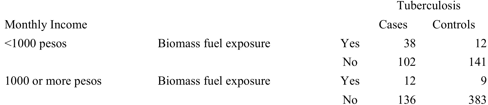

Due in class on 03/12/2015

1. Table 1 shows the data associating the binary measure of alcohol consumption with esophageal cancer incidence, which can be stratified into two age groups, 25 to 54 years old and 55 years old and above. Use the Mantel-Haenszel method to examine the association between alcohol consumption and incidence of esophageal cancer, adjusting for this dichotomous measure of age. Give a summary estimate of the Odds Ratio using both the Woolf and Mantel- Haenszel methods. Provide two 95% confidence intervals based on your summary estimates. Compare these confidence intervals and comment.

Table 1:  


**Answer:** Question 9.2 in the Statsitics for Epidemiology book

```{r}

```


2. In Perez-Padilla et al. (2001) the authors were concerned that the variable, monthly family income (an indicator of economic status), might confound the observed association between indoor air pollution and tuberculosis. The data stratified by income are shown in Table 2, with income information coded as “<1000 pesos per month” and “1000 or more pesos per month.”

Table 2: _Case-control data on biomass fuel exposure and tuberculosis, stratified by monthly income_  


(a) Based on the income strata, (i) what is the Odds Ratio associating biomass fuel exposure, for the
low income (<1000 pesos/month) stratum? (ii) Similarly, what is the Odds Ratio for the high income (1000+ pesos/month) stratum? Now estimate the Odds Ratio, associated with biomass fuel exposure, adjusting for income, using the Mantel-Haenszel method. Based on your calculations, what is your assessment of confounding by monthly income? Does the income variable fulfill the criteria required for a variable to be a confounder?
(b) Using both the Woolf and Breslow-Day test for interaction, examine the empirical evidence of multiplicative interaction of income and indoor air pollution. Given your results and interpretation, which Odds Ratio would you present for the data of Table 2: (i) the pooled Odds Ratio, (ii) the Odds Ratio, adjusted for income, or (iii) the stratum-specific Odds Ratios?

**Answer:** Question 10.3, 10.4 in the Statsitics for Epidemiology book

3. The healthy worker effect refers to the possibility that underlying health conditions affect an individual’s choice of employment or length of employment in a specific occupation. Using a simple causal graph, show how this phenomenon confounds the association between employment categories (for example, being an airline pilot) and mortality.

Suppose a study refines its analysis of employment effects on mortality by confining attention to a specific industry, measuring exposure by specific job characteristics, where it is known that underlying health conditions are unrelated to such characteristics. On the other hand, the length of tenure in the industry does vary by job category. Using a causal graph that includes job category, length of job tenure, underlying health conditions, and mortality, show that the unadjusted association between job category and mortality is not confounded by underlying health conditions. On the other hand, use the same graph to illustrate that confounding is introduced to these mortality comparisons by stratification by the length of job tenure.

**Answer:** Question 8.7 in the Statistics for Epidemiology book

4. Smoking increases the risk of giving birth to low birthweight infants. It also causes several respiratory conditions in the mother. Tuberculosis raises both the chances of low birthweight infants and maternal respiratory conditions, but does not alter the probability that an individual smokes. Assuming that the respiratory conditions themselves have no influence on birthweight, draw the causal graph linking smoking, respiratory conditions, tuberculosis, and infant birthweight. With this graph in mind, is the crude association of smoking and birthweight confounded by the other variables? An investigator chooses to perform an analysis of smoking and birthweight, adjusting for the levels of existing respiratory conditions. Is the adjusted association between smoking and birthweight confounded?

Repeat your work but now assuming that the relevant respiratory conditions have a direct effect on birthweight.

5. Johnson and Johnson (1972) investigated 175 cases of Hodgkin’s disease. As controls they used siblings of the Hodgkin’s patients, choosing the closest sibling of the same gender and within 5 years of age to form a matched pair. The matching reduced the data to 85 patient-sibling pairs. The paper was designed to refute an earlier claim that having a tonsillectomy increased the chances of contracting Hodgkin’s disease. Breaking the match, the 85 matched pairs provided information on prior tonsillectomy (T) experience as shown in Table 3.
  Johnson and Johnson analyzed Table 1, thereby ignoring the matching. Repeat their analysis by performing a test and giving an associated p-value, and by estimating the Odds Ratio for Hodgkin’s disease associated with a prior tonsillectomy, providing a corresponding 95% confidence interval.
  The correct way of looking at the data takes account of the pairing, as in Table 4. Perform the appropriate matched pair analysis by testing the null hypothesis of no association, giving a p- value. Also estimate the Odds Ratio, supplemented by an associated confidence interval. Compare your results with the previous analysis.

Table 3: _Case-control data on tonsillectomy history (T) and Hodgkin ‘s disease, with match broken_  


Table 4: _Matched pair case-control data on tonsillectomy history (T) and Hodgkin’s disease_  


6. Consider a 1:3 matched case-control study with a dichotomous exposure, where every case is matched to three controls on a set of matching factors. For each matched set of four subjects, there are eight possible outcomes with regard to the observed exposure pattern. Suppose there are a total of N matched sets of four. Each possible exposure pattern and the frequency with which it is observed are given in Table 5. For example, all individuals are exposed in A of the N matched sets. Using the Mantel-Haenszel approach, show that an appropriate estimator of the
Odds Ratio linking exposure to disease is given by $\widehat{OR}$ = $(\frac{B}{4}+\frac{2C}{4}+\frac{3D}{4})/(\frac{F}{4}+\frac{2G}{4}+\frac{3H}{4})$

Table 5: _Frequency of exposure patterns for N 1:3 matched case-control sets with binary exposure_  


------------------------------------------------  ----------------------
Exposure Pattern                                  Number of Matched Sets
Case exposed, all three controls exposed                    A
Case exposed, two controls exposed                          B
Case exposed, one control exposed                           C
Case exposed, all three controls unexposed                  D
Case unexposed, all three controls unexposed                E
Case unexposed, two controls unexposed                      F
Case unexposed, one control unexposed                       G
Case unexposed, all three controls exposed                  H   
Total                                                       N
------------------------------------------------  ----------------------


7. Redelmeier and Tibshirani (1997a,b,c) investigated the role of cell phone use on the risk of automobile accidents. They used data available from a collision-reporting center in Toronto and information from cell phone logs to determine whether a cell phone was in use just (up to 10 min) before the accident in question. For control information, they used the drivers involved in the accident as their own controls with a risk period defined by the exact same 10 min time window from the day previous to the accident. This study design, known as a case-crossover design, thus uses each driver as his own match. Data on 699 accidents, in particular, cell phone use on the day of the accident and the prior day, are given in Table 6. Using matched data techniques, estimate the Odds Ratio associating cell phone use with the risk of accidents. Provide a 95% confidence interval to supplement the point estimate. Critique the assumptions underlying the statistical methodology.

The data were unable to elucidate whether drivers were in their car when using a cell phone on the day prior to the accident. Assume a certain fraction of drivers were out of their cars the previous day; how would this bias the estimate of the Odds Ratio? Another concern is that some cell phone calls on the day of the accident may have occurred immediately after the accident but be misclassified as “before accident” if the timing of the accident was even slightly misreported. How would this misclassification distort an estimate of the Odds Ratio?

Table 6: _Matched pair case-crossover data on cell phone use (CP) and automobile accidents_  
